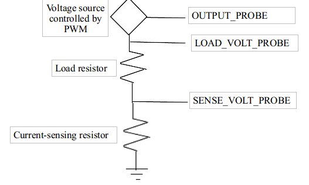

# monitored-current-source-v1
A current source which is controlled and monitored by PC using an Arduino board

## Arduino
The board is resposible for measuring the load voltage and voltage across the current-sensing resistor. It communicates with the PC through serial port. PC requests measurements and sets the output PWM value through commands issued through serial communication.

### Parameters in arduino file:
int OUTPUT_PROBE, int SENSE_VOLT_PROBE and int LOAD_VOLT_PROBE defines the pins through which the voltage measurements are read and PWM output is given. Hence, OUTPUT_PROBE should be PWM pin and SENSE_VOLT_PROBE and LOAD_VOLT_PROBE should be analog input pins. The implementation structure is given in the diagram below.  

  

## Python
Maintaining a constant current across the load resistor is done by the python program running on the PC, based on the measurements taken through the arduino board. "batcom.py" is resposible for maintaining the state and "pylive.py" is an external library for plotting.

### Parameters in batcom.py
SENSE_VOLT_PROBE, LOAD_VOLT_PROBE, OUTPUT_PROBE are string values just to remind the actual probe pins on the arduino. However, they must have different values.  

LOAD_VOLT_FACTOR is a multiplicative factor for the value of LOAD_VOLT_PROBE. Eg: if the value measured by LOAD_VOLT_PROBE is 5 and LOAD_VOLT_FACTOR=2, the actual value measured by the LOAD_VOLT_PROBE will be considered as 10. (Important when the load voltage is much higher than the maximum directly measurable value and the measurement has to be taken through a voltage divider.)  

LV_CONST is a additive correction factor for the actual load voltage.  

P, I and D values specify the pid filter values for approximating the desired state (constant current).  

MAX_VOLT_ERROR is the maximum tolerable error of voltage measurements, in Volts 
DELAY is the time between two regulatory cycles, in seconds  

COM_PORT is the default COM port to be used if none is found through the automatic scanning.

### Usage
Data such as load voltage, load current and load resistance can be plotted and saved into a csv file. Value of the constant current and maximum load voltage can be changed during operation.

##### Note: It is important to specify the value of the current-sensing resistor correctly as the current is measured in terms of the voltage across that resistor.
